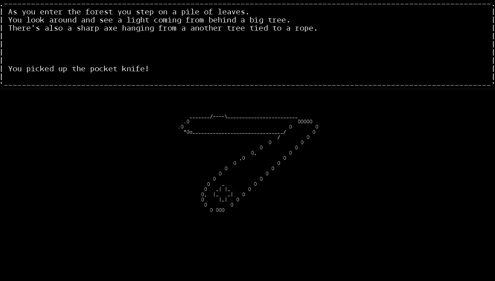

# LDTS_T09_G05 - Forest Maze

## Grade
__Final Grade: __ 12.86

## Game Description 
In this project we decided to create a graphic adventure where the player goes through the game's world and interacts with the environment through verb commands (for example, look at, pick up, etc.).
By collecting items and using them in creative ways, the player is able to progress through the game.
This project was developed by Ana Beatriz Cruz Fontão(up202003574@up.pt), Ana Rita Baptista de Oliveira(up202004155@up.pt) and José Maria Borges Pires do Couto e Castro(up202006963@fe.up.pt).

For a more detailed version of this description, click [here](./docs/README.md).

## Screenshots

The following screenshots show our game and different functionalities in action:

### Menu

  

  <b><i>Gif 1. Forest Maze Menu</i></b>

 
 

### Verb Commands

  

  <b><i>Gif 2. "Look at" Command</i></b>

 
 

  

  <b><i>Gif 3. "Interact with" Command</i></b>

 
 

  

  <b><i>Gif 4. "Pick up" Command</i></b>

 
 

  

  <b><i>Gif 5. "Hold" Command</i></b>

 
 

  

  <b><i>Gif 6. "Use on" Command</i></b>

 
 

  

  <b><i>Gif 7. "Show inventory" Command</i></b>

 
 

  

  <b><i>Gif 8. "Go to next room" Command</i></b>

 
 

  

  <b><i>Gif 9. "Go to previous room" Command</i></b>

 
 

### Ending

  

  <b><i>Gif 10. Game ending</i></b>

 
 
