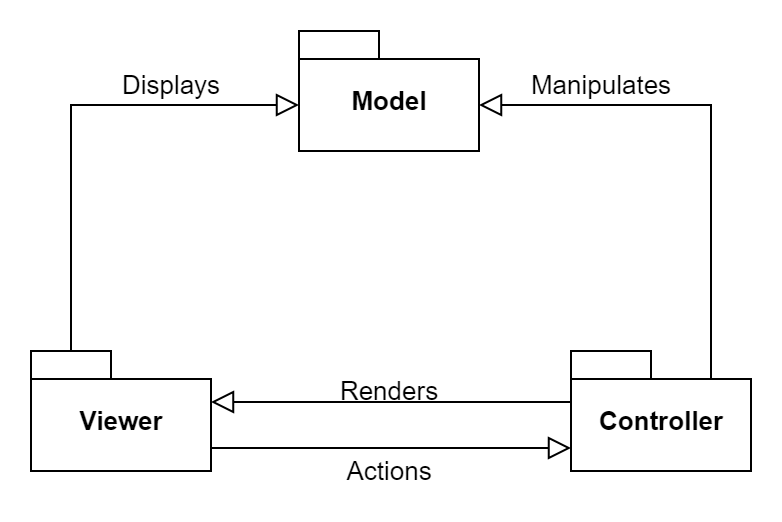
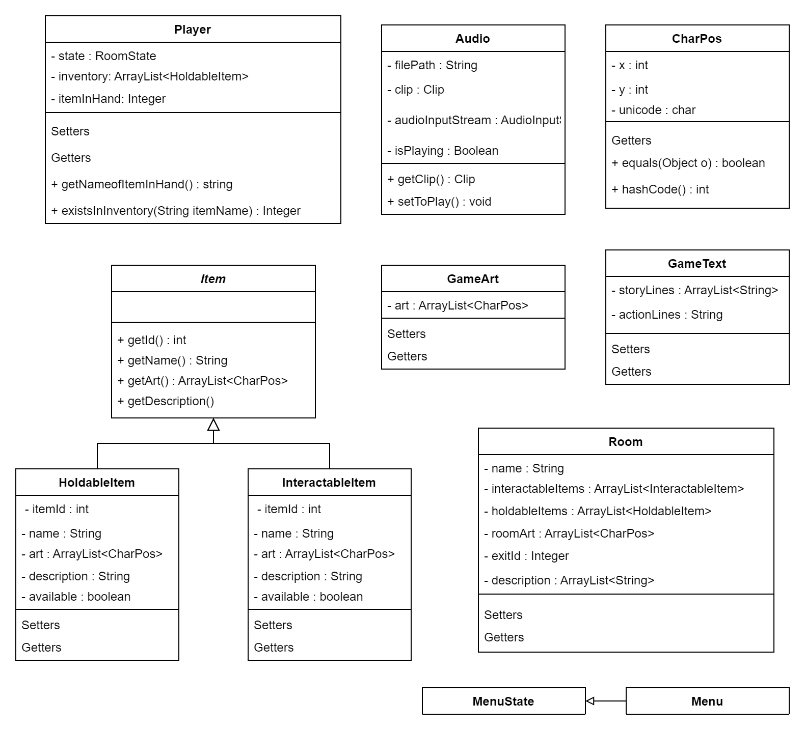
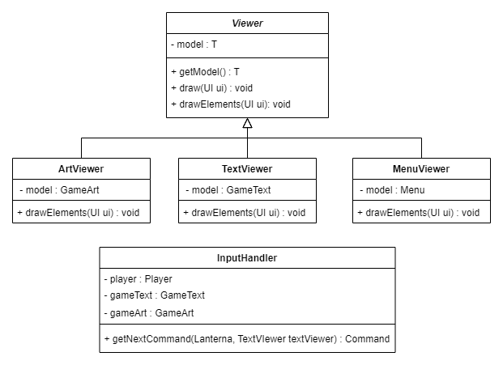
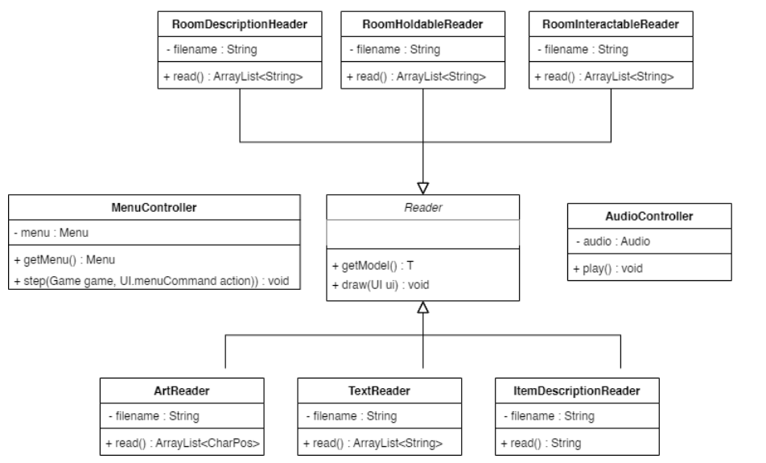
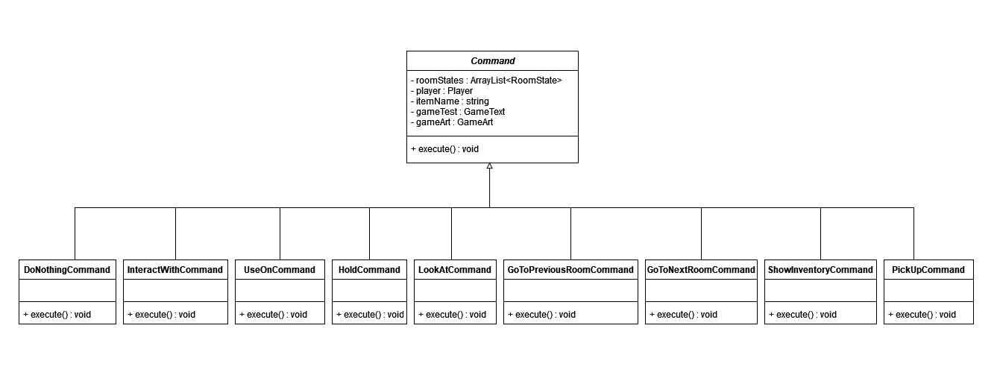
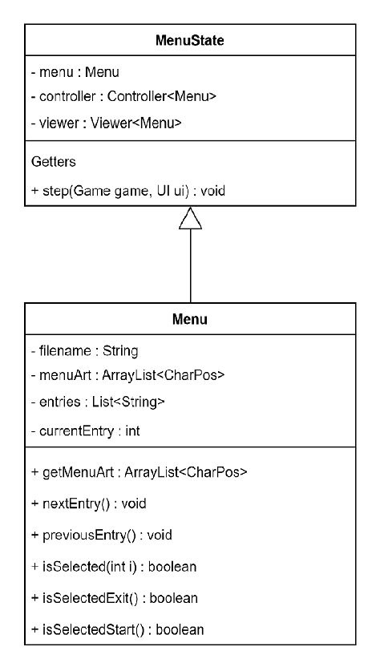
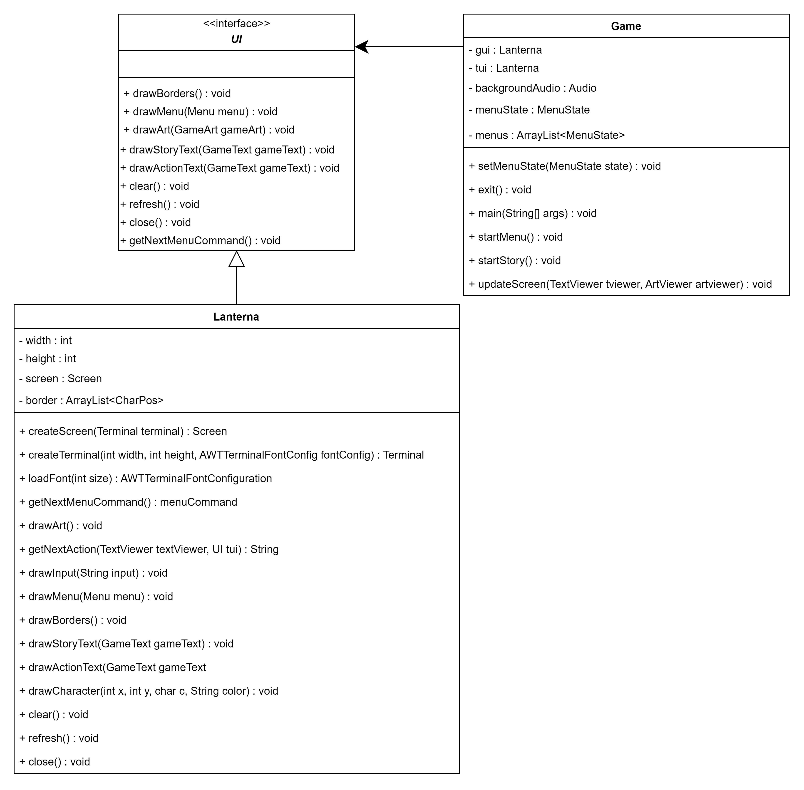
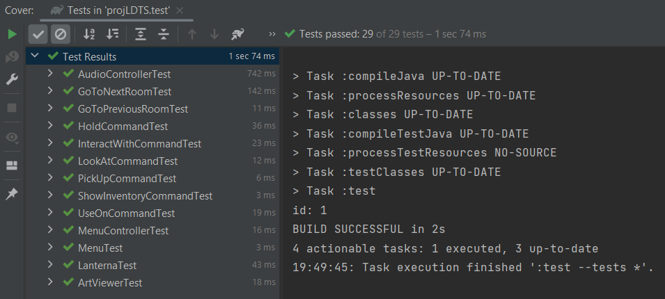
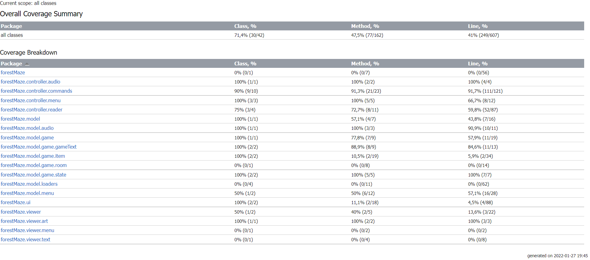

# LDTS_G0905 - Forest Maze

In this project we decided to create a graphic adventure where the player goes through the game's world and interacts with the environment through verb commands (for example, look at, pick up, etc.).
By collecting items and using them in creative ways, the player is able to progress through the game.
This project was developed by Ana Beatriz Cruz Fontão(up202003574@up.pt), Ana Rita Baptista de Oliveira(up202004155@up.pt) and José Maria Borges Pires do Couto e Castro(up202006963@fe.up.pt).

## Implemented Features

- **Different Rooms** - The player can go back and forth between 2 rooms.
- **Verb Commands**: 
  - **Look at an item** - The player can choose an item to look at and the item and its description will show.
  - **Pick up an item** - The player can choose to pick up an item and, in case said item can be picked up, it is added to the player's inventory.
  - **Interact with an item** - The player can choose to interact with an item and depending on which item it is, something may happen.
  - **Hold item** - The player can choose to change the item in their hand to the chosen item.
  - **Use on an item** - The player can choose to use the held item on an item in the room.
  - **Show inventory** - The player can choose to see their inventory.
  - **Go to next room** - The player can choose to go to the next room. In case the next room isn't yet available to be visited, the game doesn't allow the player to visit it. If the player is at the last room and writes this command, a message will appear saying the player won.
  - **Go to previous room** - The player can choose to go to the previous room visited. In case the previous room doesn't exist (the player is in the first room),the game doesn't allow the player to visit it.
- **Menu** - A simple Main Menu where you can start your journey

## Planned Features

Unfortunately we weren't able to implement every feature we planned. Our goal was to also implement the following features:
- **More Rooms** - Initially we wanted to implement 3 or 4 rooms with increasing complexity, but creating ASCII art for the rooms and items proved to be labor intensive, and with the time we had, it wasn't possible to do more than 2 rooms.
- **Instructions** - The user would be able to select the option to see the instructions on the Menu and use a **Show instructions** command to check the verb commands during the game.
- **Removing an Item after Usage** - After using the **Use on** command, the item in the player's hand is no longer useful, so it should be removed from the player's inventory. 

## Design

### **General Structure:**

#### The Pattern
Architectural pattern MVC:
- **Model** - Classes that contain information about the elements of the game. For example, the items, the player and the room.
- **Viewer** - Classes that show on the screen the data related to the game. These classes will also recieve the input given by the user and pass them to the controller to be interpreted.
- **Controller** - Classes that manipulate the data of the model according to the inputs received. These classes also inform the viewer what and when to show the model.

#### Implementation

  

  <b><i>Fig 1. MVC pattern design</i></b>

Here we can find a more in depth look at each component of the MVC pattern:

  

  <b><i>Fig 2. Model of the MVC pattern design</i></b>

  

  <b><i>Fig 3. Viewer of the MVC pattern design</i></b>

  

  <b><i>Fig 4. Controller of the MVC pattern design</i></b>

These classes can be found in the following packages: 
- [Model](../src/main/java/forestMaze/model/)
- [Viewer](../src/main/java/forestMaze/viewer/)
- [Controller](../src/main/java/forestMaze/controller/)

#### Consequences
The use of the MVC pattern in the current design allows the following benefits:
- A well organized code acknowledging the Single Responsibility Principle.
- Easy to add new features throughout the development stage.

### **Different types of verb commands:**

#### Problem in Context
According to different keyboard inputs and the current state of the player, the game might execute different commands.

#### The Pattern
We have applied the **_Command_** pattern. This pattern allows you to represent different commands with different subclasses that extend the abstract class Command. This pattern can solve the problem referred above because we can execute a specific command according to the player's input.

#### Implementation

  

  <b><i>Fig 5. Command pattern design</i></b>

These classes can be found in the following file: 
- [Command](../src/main/java/forestMaze/controller/commands)

#### Consequences
The Command Pattern in the current design allows the following consequences:
- The code became more complicated since it introduced a whole new layer between senders and receivers.
- It gave more structure to our program's controller.
- If we wanted to implement a different command, it would be quite easy to add .

### **Menu**

#### Problem in Context
Before the game engine comes into play, we decided it would be best to have a small, visually appealing and interactive menu to open the program with. 

#### The Pattern
We have applied the **_State_** pattern to solve this issue. By assigning states to each menu screen, the menu understands the user's input according to the menu currently being displayed on screen and manipulates what is needed.

#### Implementation

  

  <b><i>Fig 6. State pattern design</i></b>

These classes can be found in the following files: 
- [Menu](../src/main/java/forestMaze/model/menu/Menu.java)
- [MenuState](../src/main/java/forestMaze/model/menu/MenuState.java)

#### Consequences:
The Command Pattern in the current design allows the following consequences:
- Easy and understandable menu structure.
- Implementing a new menu is only as hard as getting the ASCII art it's supposed to display.

### **UI:**

#### Problem in Context:
The lanterna library has many functions that we don't need in our project and is missing some other methods that our interface needs.
Because of this, we implemented an interface that solves this problem.

#### The Pattern:
We have applied the **_Facade_** pattern. The facade provides a convenient access to a particular part of the lanterna's functionalities, while also allowing us to implement specific methods useful to our program.

#### Implementation

  

  <b><i>Fig 7. Facade pattern design</i></b>

These classes can be found in the following files: 
- [Game](../src/main/java/forestMaze/Game.java)
- [UI](../src/main/java/forestMaze/ui/UI.java)
- [Lanterna](../src/main/java/forestMaze/ui/Lanterna.java)

#### Consequences:
The Command Pattern in the current design allows the following consequences:
- Isolate code from the complexity of the lanterna library.
- Expand lanterna functionalities.

## Known Code Smells

### Bloaters:

#### Lazy Class:
The DoNothingCommand, as the name might suggest, is a class that does nothing.
We created this class, because our Input Handler returns a Command that will be later be executed. 
This means that when the user inputs an incorrect Command, we needed something to return, hence the need for a Command that does nothing.

#### Large Class:
The Lanterna class is a large class, which becomes problematic when we want to find specific segments of code inside the class.
Despite this, we don't consider this code smell an issue to our project.

#### Large Method
The startStory method is a large method where we load all the game's rooms which made it quite long.
We could fix this code smell by: 
- dividing this method
- if we were to use files to load the rooms in a less hard coded way, we could create new methods/classes and only call those inside those new methods/classes.  

### Change Preventers:

#### Parallel Inheritance Hierarchy
The Element hierarchy and the View hierarchy represent this situation. 
If we wanted to add a new visible element to the game, we would be obligated to create a new Model class (the concrete element) and a new View class for it.
The only way to fix this code smell would imply moving parts of the View into the Model (or vice-versa). This would be a violation of the MVC architectural pattern.

### Dispensables:

#### Duplicate Code 
This occurs when we have two code fragments look almost identical.
This happens with some methods in the Lanterna Class. For example, the methods drawStoryLines and drawStoryText are quite similar. 
To fix this, we could create a more abstract method, that could be used to do the same job as the other two methods.

### Couplers:

#### Middle Man
The only purpose of the Input Handler class is to delegate work to the controller. Essentially this class receives an input and chooses which command will do the actual work.
We don't consider this code smell an issue since this was done to respect the MVC architecture.

## Testing

### Tests:

### Coverage:

### Link to mutation test report:
[Mutation tests](pitest/index.html)

## Self-evaluation

**Work Distribution**:

- Ana Beatriz Fontão: 33.3%
- Ana Rita Oliveira: 33.3%
- José Castro: 33.3%
